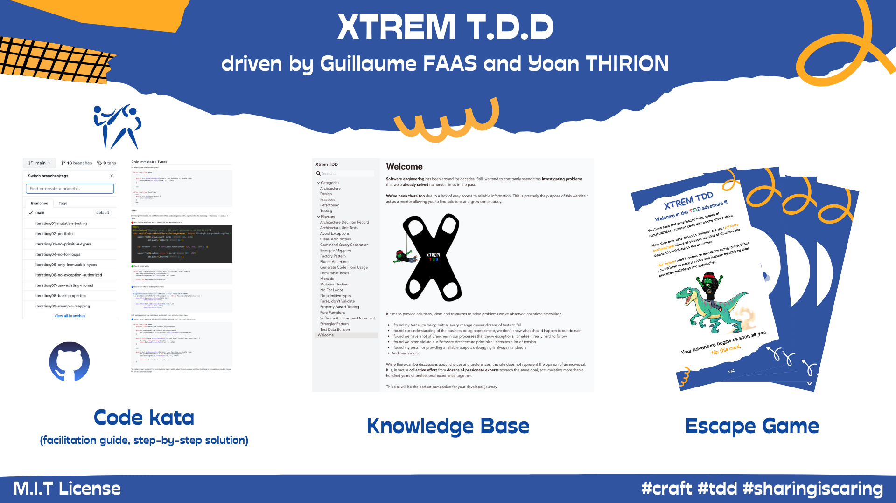

# Who I am
Hi folks, I am [Yoan Thirion](https://www.linkedin.com/in/yoanthirion) a Technical Agile coach.

I have designed software since more than 15 years now. My various experiences in fields like banking, insurance and industrial environments at Luxembourg helped me understood what were really fundamental to succeed in that area : agility and craft practices.

That's why since a few years I am focusing on helping teams deliver well crafted software by coaching them on the implementation of agile practices.

I coach teams get better at XP practices, Continuous Integration and Development, Domain Driven Design, Clean Code, BDD and many other technical practices 
(Mob programming, efficient code review, refactoring, functional programming ...).

## What I do...

### Programming languages

### GitHub stats

### Contributions

## Xtrem T.D.D
With [@Tr00d](https://github.com/tr00d), we are working on the creation of  a code kata to demonstrate a lot of learnings we had during the past years and 
shorten the learning curve of developers.

We are really proud to have a full workshop including facilitation guide, step-by-step solution in `C#` and `java`, a knowledge base and an escape game that you 
can use as facilitator for the first iterations.

We had great feedback on it and chosen to publish all the content for free under M.I.T license, so you can find:
- The code kata including instructions and step-by-step solutions [here](https://github.com/les-tontons-crafters/xtrem-tdd-money-kata)
- [Our Xtrem Knowledge Base](https://xtrem-tdd.netlify.app/)
- [Our escape game including cards and solution (based on cards)](https://github.com/les-tontons-crafters/xtrem-tdd-escape-game)

During the code kata participants will learn and practice: 
- Test-Driven Development
- Mob Programming
- Functional Programming
- Mutation Testing
- Property-Based Testing
- Test Data Builders
- Example Mapping
- Clean Architecture
- Fight Primitive Obsession
- Clean Code
- Parse don't validate
- S.O.L.I.D principles
- Functional Core / Imperative Shell
- Outside-in T.D.D
- Acceptance Testing / BDD

Do not hesitate to fork it, contribute, give feedback or anything else 😉

## Refactoring du Bouchonnois
A full workshop in french to learn and practice the below flavours :
- Example Mapping
- Static Code Analysis / Linter
- Treat Warnings as Errors
- Mutation Testing
- Test Data Builders
- Approval Testing
- Automated Refactoring
- Property-Based Testing
- Tests d'Architecture
- Test-Driven Development
- Clean Architecture
- Domain Driven Design
- Tell Don't Ask
- Functional Programming
- Avoid Primitives
- Avoid Exceptions
- Architecture Decision Records
- Event Sourcing
- ...

Repository available [here](https://github.com/ythirion/refactoring-du-bouchonnois)

## Advent Of Craft 2023
25 challenges to learn and practice craft techniques.

More infos [here](https://github.com/advent-of-craft/advent-of-craft).

## Software Crafter Journey
This journey is an attempt to centralize useful resources (code kata, workshops, talks) that can help aspiring Software Craftsperson in their Journey.

Repository available [here](https://github.com/ythirion/software-crafter-journey)

## Resources
- [Personal website](https://www.yoan-thirion.com/#home)
- [Knowledge base](https://yoan-thirion.gitbook.io/knowledge-base/)
- Reach me on [linkedin](https://www.linkedin.com/in/yoanthirion) 
